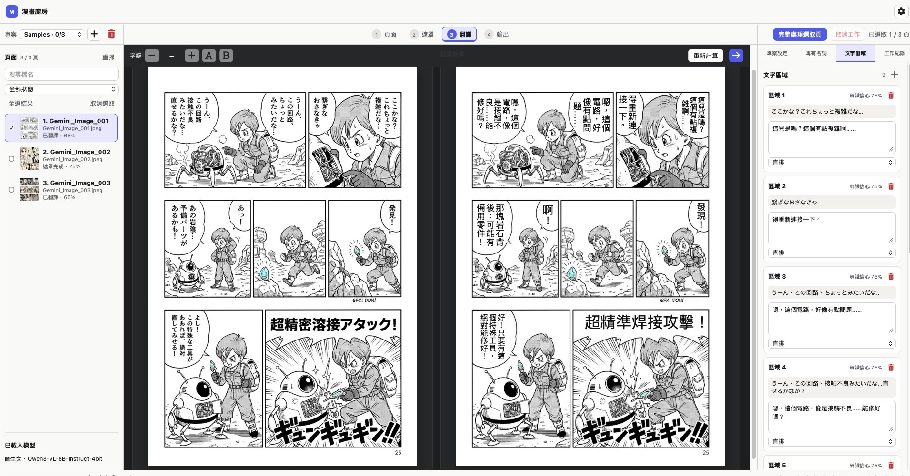

# 漫画キッチン（MangaKitchen）

[繁體中文](README.zh-TW.md) | [English](README.md) | 日本語 | [한국어](README.ko.md)

漫画キッチン（MangaKitchen）は、macOSネイティブの漫画翻訳ワークスペースです。フロントエンドはHTML + JavaScript、Swift Packageのバックエンドはドメインコア、Metal/Core ML Runtime、WKWebView Appの3層に分かれています。コアは特定のUIレイアウトに依存せず、モデル境界、ページ単位のワークフロー、台詞領域、マスク、組版を扱います。

<p align="center">
  
</p>

## 著作権と適法な利用

MangaKitchenに読み込まれる漫画原稿、キャラクター、文章、作画、商標その他のコンテンツに関する著作権および関連する権利は、原作者、出版社、正規配信プラットフォーム、その他それぞれの正当な権利者に帰属します。本ツールを使用してもこれらの権利は移転せず、作品の複製、翻訳、公衆送信、配布、販売の許諾が与えられるものではありません。

MangaKitchenは、正式な許諾を得た翻訳者、ローカライズチーム、その他の適法な利用者が、ページ、マスク、訳文、用語、組版を効率的に管理し、反復作業を減らすことで、より速く高品質な正規翻訳を読者へ届けるための支援ツールです。翻訳成果は二次的著作物に該当する場合があります。原稿や翻訳成果を公開、共有、配布する前に必要な許諾を取得し、適用法令、コンテンツのライセンス、および使用するモデルやAIサービスの規約を遵守してください。

海賊版、無許諾の翻訳・スキャンレーション、クラックされたコンテンツの作成や配布、DRM、透かし、その他の権利保護措置の回避にMangaKitchenを使用しないでください。開発者は著作権侵害を推奨または支援しません。正規の単行本、電子書籍、サブスクリプション、ライセンス商品を正規の販売経路から購入し、作者、翻訳者、出版社、そして創作文化全体を支援してください。

## ソフトウェアライセンス

MangaKitchenはデュアルライセンス方式を採用します。本repository内でMangaKitchenの著作権者が権利を持ち、別途表示のないコードは、標準で[GNU General Public License version 3 only](LICENSE)（`GPL-3.0-only`）の下で提供されます。クローズドソース製品への統合、プロプライエタリな配布、または異なる契約条件が必要な場合は、別途[商用ライセンス](COMMERCIAL-LICENSE.md)を利用できます。

GPLv3自体も商用利用と有償配布を認めていますが、ソースコード提供およびcopyleftの義務を守る必要があります。商用ライセンスは代替案であり、GPLv3で既に得た権利を制限しません。第三者package、モデルとweight、フォント、漫画コンテンツはMangaKitchenのデュアルライセンス対象外で、それぞれの条件に従います。

## 実装済み機能

- macOS 14以降に対応するSwiftUI / WKWebViewアプリケーションシェル。
- HTML/JavaScriptとSwift間の非同期JSON Bridge。
- `AUTO`、繁体字中国語、英語、日本語、韓国語のWeb UI。AUTOはmacOSの言語に従い、手動設定は次回起動後も保持され、ネイティブパネルとMCPメニューバーにも反映されます。
- 一般、詳細、モデル、MCP、情報の各タブを持つグローバル設定DLG。言語、配色、CPU／GPU画像合成、データ保存先、マルチモーダル／文字位置検出／OCR／テキスト生成／超解像モデル、MCPポート、IP/CIDR許可リストを設定できます。
- ソースフォルダごとに独立したプロジェクトを作成し、複数プロジェクトを保存・切り替えできます。
- サブフォルダの相対パスを保持する再帰スキャン、自然順ソート、同名ファイルの衝突回避。
- Command／Shiftによる複数選択、検索、状態フィルタ、選択ページのマスク・翻訳・合成の一括処理。
- 単一の逐次バッチキュー、現在ページ、成功／失敗数、キャンセル、履歴消去、失敗ページの再試行。領域単位の翻訳中は現在の領域／総領域数と実際の進捗も表示します。
- プロジェクトごとの多言語用語集。1つの原語に複数のBCP-47翻訳を保存し、対象言語に応じて自動選択します。
- 4段階ワークフロー：スキャン、文字／マスク、翻訳／組版設定、背景修復／合成。ページ全体および全ページの一括実行も利用できます。
- 画像ごとのバージョン付き`.str` JSONに、文字、位置、フォント、固定／自動サイズ、マスクストロークを保存。
- 原画像のピクセル層で膨張してアンチエイリアスの縁を取り込み、正規化ブラシでマスクを追加・消去・領域単位に取り消して二値PNGを生成します。各run矩形をベクター描画する方式は廃止し、灰色の毛羽立ちを防ぎます。ステップ2の完了後、画像編集モデルを起動せず、原文を消去したCPU／GPUマスク確認プレビューを直ちに表示します。
- 同梱の manga109 吹き出し分割 Core ML モデルが、Apple Neural Engine を優先して白黒漫画の対話 BBOX と吹き出し形状を生成します。ステップ2は常にその吹き出しを原画像ピクセルから文字マスクへ精修し、OCR／VLM の選択でこのマスク処理は変化しません。Apple Vision OCR は使用しません。効果音、ページ番号、フッター情報、人物、空白領域は主処理から除外します。
- ステップ2は PP-OCR 文字検出も `imageToText` VLM も必要としません。Medium Det と VLM の位置検出 runtime はマスク生成から分離され、モデル切り替えによる既存の吹き出し／ピクセルマスクの退行を防ぎます。ステップ3では PP-OCRv6 Medium recognizer を標準で使用し、Small を fallback として保持します。`sourceText` が空の場合は既定 OCR 結果を翻訳原文に採用しますが、確認済み原文、座標、マスクは上書きしません。
- 翻訳方式はダウンロード済みのテキスト生成モデルまたはマルチモーダルモデルから選択できます。標準のテキスト生成方式は OCR／VLM が抽出した原文だけを受け取り、ページ画像を読みません。マルチモーダル方式は画像文脈、文字位置検出、原文抽出にも使用できるため、VLM はワークフロー全体の必須条件ではありません。
- 受理された領域は対話 BBOX を検索範囲として原画像の連結成分からピクセル文字マスクへ精修し、文字領域を膨張前の実際のglyph外接矩形へ縮小します。自動組版の方向は実際の字形排列を優先します。各候補は独立して処理し、1領域の分類・転記・翻訳に失敗してもその領域を保持して他の領域を続行します。キャンセル時だけ全体を停止します。
- 画像テキスト化モデル向けのページ文脈プロンプトと厳格なJSON応答解析。
- Apple Silicon／Metal上で`mlx-swift-lm`を使用するローカルHugging Face MLX VLMの読み込み。
- model manifestによる`.mlmodelc`、`.mlmodel`、`.mlpackage`の読み込みと、Metal GPUを指定したCore ML実行。
- 台詞マスクは1つ以上のピクセル形状で元文字を覆い、吹き出し境界でクリップした上でブラシによる追加・消去を重ねられます。画像モデルがない場合はCPUまたはMetal GPU修復を選択できます。
- HTML/CSSを翻訳組版の唯一の基準とし、横書き／縦書き、固定または自動文字サイズ、ドラッグ、領域サイズ変更に対応します。最終PNGもWebKitが同じ文字レイヤーを描画するため、ステップ3の組版が出力時に別方式へ置き換わりません。
- 任意のファイルを公開せず、制限付きカスタムURL SchemeでWeb UIに原稿と出力画像を提供。
- プロジェクト索引と状態をバージョン付きJSONとして自動保存。書き込み前に旧版を`.bak`として残し、起動時に検証して復元。
- オプションのmacOS 26 Swift/MLX Qwen Image Edit worker。マスクをモデル条件と最終合成範囲の両方に使用。
- 4段階tools、workspace／画像resources、キャンセル、進捗通知を備えた標準MCP Streamable HTTP server。
- MCP有効時はmacOSメニューバーに常駐し、メインウィンドウを閉じた後も再表示できます。
- テキスト／マルチモーダルモデルは使用時に初めて遅延ロードされ、同じモデル container を再利用します。メモリ負荷が高い場合は、大型モデルをロードする前に他の runtime を解放します。
- **Think Mode (Beta)** は既定でオフです。短い推論を安全な Markdown で表示し、推論を LOG に保存しません。完全な JSON が得られなければ、同じモデルで非思考の最終 JSON を生成します。
- ツールバーからメモリ内 LOG を開いて消去できます。下部ステータスバーの GPU、MEMORY、解像度、倍率は transient 更新され、選択やドラッグ操作を中断しません。
- 起動時に GitHub の最新安定版を確認し、「設定 → 情報」に公式 GitHub／Releases URL と手動の「更新を確認」を表示します。App は公式パスだけを開き、自動ダウンロードやインストールは行いません。

## 2つの利用方法、共通のプロジェクトと4段階ワークフロー

MangaKitchenには2つの利用方法があります。違うのは推論と操作を誰が担当するかだけで、データ形式や処理フローは共通です。すべての作業はソースフォルダのプロジェクトから始まり、ページ、マスク、翻訳、組版設定、用語集、出力状態はそのプロジェクト内に保存されます。

共通する4つの段階は次のとおりです。

1. **プロジェクトとページ**：ソースフォルダを選択して画像を再帰スキャンし、複数選択・一括処理可能なページ一覧を作成します。
2. **文字とマスク**：内蔵Core ML分割モデルで対話 BBOX と吹き出し形状を検出し、原画像ピクセルから文字形状maskへ精修します。この段階ではVLMを呼び出しません。MCP Agentは領域と原文を直接提供でき、利用者はmaskを追加・消去・修正できます。
3. **翻訳と組版**：GUIは同梱 OCR または選択した VLM で原文を抽出し、選択したテキスト生成／マルチモーダルモデルで翻訳、任意の二次校正、意味 QA を実行します。MCPはAppが作成した単一ページの作業パッケージをAgentへ渡して原文抽出・翻訳・組版を行い、結果をAppのプロジェクト状態へ戻します。
4. **修復と合成**：元の文字を除去し、背景を修復して訳文を組版し、プロジェクトの出力先へ保存します。

4段階は再開可能な状態、生成物、依存関係を定義するもので、毎回ステップ1からやり直す固定チェックリストではありません。GUIとMCPはAppが提供するページ状態と作業パッケージを確認し、前提データがある任意の段階から開始できます。マスクがあれば翻訳へ、訳文があれば組版や合成へ直接進めます。明示的に再実行を求めない限り、完了済みの領域認識、マスク、訳文、手動編集を上書きしません。

任意の段階から開始する前に、状態名だけでなくページごとの実データを検証します。前提生成物がなければ、必要な作業が見つかるまで1段階ずつ戻ります。

- ステップ4の前に、有効なマスクと`.str`の訳文／組版データを確認します。訳文がなければステップ3へ、文字領域またはマスクがなければさらにステップ2へ戻ります。
- ステップ3の前に、原稿ページ、文字領域、OCR／VLM／Agent／利用者が提供した原文、マスクを確認します。不完全ならステップ2へ戻ります。
- ステップ2の前に、原稿画像の存在とプロジェクトのページ索引を確認します。失効していればステップ1で再スキャンします。
- 戻る処理は欠損または失効したデータだけを補い、有効な前提生成物は再作成しません。ページごとに異なる段階から再開できます。

### 方法A：モデルをダウンロードして完全オフラインで実行

「設定 → モデル」で画像テキスト化モデルと、必要に応じて画像変換モデルを指定します。領域認識、翻訳、背景修復、合成はMac上で実行されます。モデルのダウンロード後は、漫画の内容を外部AIサービスへ送信する必要がありません。

- `imageToText` VLM は、プロジェクトが VLM 原文抽出またはマルチモーダル翻訳を明示的に選択した場合だけ必須です。ステップ2のマスク、PP-OCR の「原文を再抽出」、テキスト生成モデルでの翻訳、再組版、出力は VLM なしで動作します。
- `imageToImage`モデルはステップ4の背景修復を担当するオプションです。未設定時は「設定 → 詳細」でMetal GPU近傍修復またはCPUによる吹き出し主要色修復を選択でき、GPU失敗時はCPUへ自動的に切り替わります。
- GUIでは各段階を個別に実行でき、「選択ページ／全ページを完全処理」も利用できます。一括実行も内部ではステップ2〜4を順番に処理し、中間データを保持します。
- 結果はプロジェクトと`.str`へ戻されるため、任意の段階を修正して後続段階だけを再実行できます。

### 方法B：AI AgentからMCP経由で校正（推奨）

> **より推奨する流れ：先にローカル処理を実行し、その後MCPで校正します。** 空のプロジェクトからMCPだけで開始することもできますが、先にAppで4段階の下書きを作成すると、Agentが既存の原文、翻訳、組版を直接確認でき、より安定した結果になります。MCPはAppが作成した領域とmaskを保持し、再作成や上書きを行いません。

「設定 → MCP」でサービスを有効にし、ポートとクライアントIP/CIDR許可リストを設定して、Streamable HTTP対応のAI Agentを接続します。MCPはAgentに4段階を分解・消去・再構築させず、単一ページの作業パッケージだけを提供します。

1. （推奨）GUIでプロジェクトを開き、ローカルモデルを読み込んで「選択ページ／全ページを完全処理」を実行し、4段階の下書きを一括作成します。この手順を省略して空のプロジェクトから開始することもできます。
2. 「設定 → MCP」でサービスを有効にし、Streamable HTTP対応のAI Agentを接続します。
3. Agentは`mangakitchen.workspace.open`で`workspace_id`を取得し、対象ページごとに`mangakitchen.page.prepare_agent_task`を呼びます。ステップ2が未完了ならAppが先に吹き出し領域とピクセルmaskを生成し、原画像のimage contentと内包された`regionData` JSONを返します。
4. Agentは既存領域ごとに処理します。空でない`sourceText`／`translatedText`は原画像と照合して校正する下書きとして扱い、誤りや空白を修正し、HTML組版のサイズ、位置、字重、縦横方向も調整します。領域やmaskを追加・削除・結合・変更してはいけません。
5. `mangakitchen.page.submit_agent_result`で校正済みの原文、翻訳、組版結果を全領域分まとめて返します。Appはステップ2 maskを保持して内部プロジェクト状態を更新し、直ちにステップ4の合成と出力を実行します。

`region_source`と旧来の領域単位toolは互換性のために残りますが、既定のMCPフローではありません。MCPのステップ3は完全にAgentが担当し、App内蔵VLMによる転記・翻訳は実行しません。Agentは`.str`を検索・読取・作成してはならず、複数resourceの読取や`region.update`も必要としません。

既存プロジェクトでAgentが完了済み段階を独自に消去、再スキャン、再実行してはいけません。利用者が指定したページだけ作業パッケージを準備します。`workspace.pages`は状態照会であり、自動ループ開始の命令ではありません。

MCPモードも複数workspace、明示的な`workspace_id`、複数ページの一括処理、プロジェクト用語集、キャンセル、進捗通知に対応します。AI Agentはワークフローの操作者であり、別の保存バックエンドではありません。

## 実行

```bash
swift build
swift run MangaKitchen
```

GUIと同時にMCP serverを起動する場合：

```bash
swift run MangaKitchen --mcp=on
```

GUIは常に起動します。`--mcp`を省略すると保存済み設定を使用し、`--mcp=on|off`は今回の起動だけを上書きします。listenerは`0.0.0.0`にbindし、既定ポートは`12080`です。実際の接続元IP/CIDRが許可リストにあるrequestだけを受け付け、初期値は`127.0.0.1`のみです。ローカルendpointは`http://127.0.0.1:12080/mcp`で、`--mcp-port=<port>`でも上書きできます。メインウィンドウを閉じてもAppは終了せず、メニューバーから再表示できます。

データ保存先の変更は再起動後に反映されます。2種類のモデル変更は即時反映され、MCPスイッチ、ポート、許可リストの変更時はlistenerが再起動します。

既定のデータ保存先：

```text
~/Library/Application Support/MangaKitchen/
  Projects/library.json
  Projects/<project-uuid>/project.json
  Artifacts/<page-uuid>/
```

各`.str`は原画像と同じ場所に保存されます。例えば`ComicTest/001.webp`には`ComicTest/001.str`が対応します。指定した出力フォルダには最終PNGのみを保存します。旧配置の`.str`は原画像の横へコピーし、旧ファイルも保持します。

旧`Workspace/workspace.json`は初回起動時に最初のプロジェクトへ移行され、元ファイルは残ります。

## モデル形式

モデルフォルダには`mangakitchen-model.json`が必要です。例：

- `Examples/Models/ImageToTextModel/mangakitchen-model.json`
- `Examples/Models/ImageToImageModel/mangakitchen-model.json`
- `Examples/Models/MLXVLMModel/mangakitchen-model.json`
- `Examples/Models/QwenImageEditModel/mangakitchen-model.json`

manifestのfeature名はCore MLモデルと一致させます。現在のAdapterは画像テキスト化の画像／任意prompt／文字列出力、および画像変換の画像／任意mask・prompt／画像出力を扱います。

Core ML manifestは1回のpredictionとしてパッケージ済みのモデル向けです。tokenizerと逐次decodeが必要なQwen-VLは専用MLX Adapterを使用し、sampler loopを持つdiffusion modelも専用`ImageToImageGenerating` Adapterが必要です。コアpipelineは変更しません。

`MLXTextRuntime`と`MLXVLMRuntime`は、`mlx-swift-lm`が対応するローカルのテキスト生成／マルチモーダルモデルを読み込めます。テキスト翻訳には`mlx-community/Qwen3-4B-4bit`、マルチモーダル用途には約3GBの`lmstudio-community/Qwen3.5-4B-MLX-4bit`を推奨します。

1. Hugging Faceモデル一式をローカルフォルダへダウンロードします。
2. `Examples/Models/MLXVLMModel/mangakitchen-model.json`をモデルのルートへコピーします。
3. Appでそのフォルダを選択します。初回読み込み後はcontainerをメモリに保持してページ間で再利用します。

単一のsafetensorsだけでは利用できません。`config.json`、tokenizer、processor、chat templateも保持してください。

## Qwen Image Edit Worker

画像変換は独立したSwift Packageで実行し、完了またはキャンセル後に大型モデルを解放します。現在macOS 26が必要です。

```bash
Scripts/build-qwen-image-edit-worker.sh
```

開発時の検索先：

```text
RuntimeSupport/QwenImageEditWorker/.build/release/MangaKitchenQwenImageEditWorker
```

正式な`.app`では`Contents/Helpers/`へコピーします。`MANGAKITCHEN_QWEN_WORKER`で絶対パスも指定できます。

```text
QwenImageEditModel/
  mangakitchen-model.json
  snapshot/
    vae/
    text_encoder/
    processor/
    transformer/
  quantized/
    qie-2511-dit-int4-mod8.safetensors
    qie-2511-vl7b-int4.safetensors
```

`snapshot`はQwen Image Edit 2511基礎モデル、2つのINT4ファイルはSwift Runtime用の事前量子化モデルです。Workerへ原稿と二値maskを渡し、生成後はmask内の画素だけを採用します。

## パッケージ構成

```text
MangaKitchenCore       ドメインデータ、座標、処理設定、モデル／ワークフローprotocol
MangaKitchenRuntime    閉領域検出とVLM転記、読み順、Core ML/Metal、マスク、修復
MangaKitchenApp        SwiftUI、WKWebView、URL Scheme、JSON Bridge、HTML/JavaScript組版とPNG出力
MangaKitchenApp/MCP    GUI process内のMCP Streamable HTTP adapterとライフサイクル
```

設計とデータフローは[Documentation/ARCHITECTURE.md](Documentation/ARCHITECTURE.md)、Swift／JavaScript／MCP契約は[Documentation/WORKFLOW_API.md](Documentation/WORKFLOW_API.md)を参照してください。

## 既知の制限

- 同梱の `manga109-segmentation-bubble`、PP-OCRv6 Medium の標準モデル、Small fallback Core ML モデルは Apache-2.0 の元モデルから生成しています。元の画像テキスト化重み、超解像、画像変換モデルの重みは同梱しておらず、容量、ライセンス、配布方法は別途扱います。OCR の変換済み `.mlpackage` とライセンス声明は repository に含まれます。
- 対話 BBOX と Agent の粗枠は、気泡形状で範囲を制限した上で原画像の明度・連結成分とピクセル膨張により精修します。暗色／カラーの作品や対話以外の文字は、`DialogueRegion` の形式を変えずに精密な Agent polygon で補えます。効果音は意図的に翻訳主処理から外しています。
- Metal近傍修復は代替手段です。複雑な網点や線画をまたぐ文字にはinpainting modelを推奨します。
- Qwen Image Edit INT4は約25GB級の推論メモリとページごとの完全なdiffusionを必要とします。
- App Sandboxのsecurity-scoped bookmark、署名、notarization、正式な`.app` packagingは未実装です。
